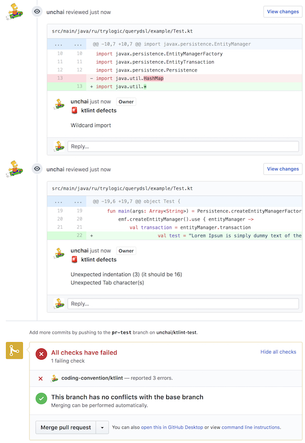

# ktlint-github-gradle-plugin 

[](https://travis-ci.org/unchai/ktlint-github-gradle-plugin)

A gradle plugin that leaves comment of the result of a "KtLint" on github's pull request.



### Requirements

* Gradle 4.6+
* Kotlin 1.2.51+

### Install

```
plugins {
  id "com.github.unchai.ktlint-github" version "0.0.1"
}

ktlintGithub {
  ghEndpoint = "https://api.github.com"
  ghRepository = "owner/repo"
}
```

### Usage

```shell
$ gradlew ktlintGithub \
    --githubOAuth=<github oauth token> \
    --githubPullRequest=<pull request id>
```

#### with Jenkinsfile

```
node {
    stage('lint') {
        if (env.CHANGE_ID) {
            withCredentials([[$class: 'StringBinding', credentialsId: 'github-bot', variable: 'GITHUB_ACCESS_TOKEN']]) {
                sh "'${pwd()}/gradlew' ktlintGithub" +
                   " --githubOAuth=${GITHUB_ACCESS_TOKEN}" +
                   " --githubPullRequest=${env.CHANGE_ID}"
            }
        }
    }
}
```

## License

Apache License 2.0 © 2018 [unchai](https://github.com/unchai)

